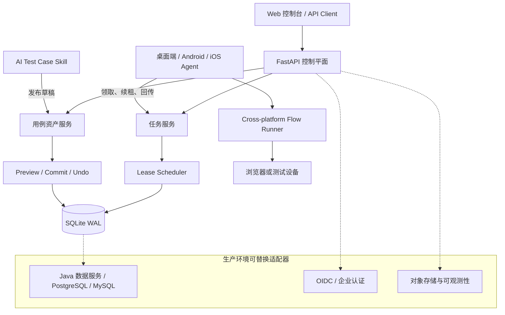

# Device Test Lab｜分布式设备测试与用例资产平台

[English summary](#english-summary)

一个可自托管的测试控制平面，用于管理执行任务、协调桌面端和移动端 Agent，并承接 AI 生成用例的预览、发布与撤销。公开版本保留了可运行的调度和资产闭环，同时将公司数据库、认证和业务页面隔离在适配层之外。

## 当前已实现

### 分布式任务执行

- FastAPI 控制服务与轻量 Web 控制台
- 任务创建、查询、取消和结果回传
- Agent 主动领取任务，按平台能力匹配设备
- 基于 Lease 的占用、续租和超时恢复，避免 Agent 异常后任务永久卡死
- Agent 调用 `cross-platform-test-studio` 执行 Flow 并上传结果

### 测试用例资产

- 用例集列表与详情查询
- 发布前预览新增、重复和冲突
- 经确认后提交，使用 operation id 保证幂等
- 保存发布前状态并支持撤销
- 支持 AI Skill 通过通用 HTTP 协议发布完整用例集或选定功能分支

### 工程能力

- SQLite WAL 本地持久化
- Bearer Token 参考认证
- Dockerfile 与部署文档
- 调度、持久化、接口和用例发布测试

## 架构



## 快速开始

```bash
python -m venv .venv
source .venv/bin/activate
pip install -e .
device-lab-api
```

打开 `http://127.0.0.1:8877`。启动本地执行 Agent：

```bash
device-lab-agent \
  --device-id local-mac \
  --platform desktop \
  --studio-root ../cross-platform-test-studio
```

需要认证时，在 API 与 Agent 两侧配置相同的 `DEVICE_LAB_TOKEN`。

## 生产接入边界

当前实现可独立演示和二次开发，但以下能力属于扩展接口，不应误认为已经完整实现：

- PostgreSQL / MySQL 或既有 Java 数据服务适配器
- OIDC、企业单点登录和权限模型
- 大文件对象存储、视频录制及实时设备画面
- 面向大规模集群的多实例调度和可观测性

持久化和认证已与核心逻辑分离，生产接入时可以替换实现而不改变任务与用例发布协议。

## English summary

Device Test Lab is a self-hosted control plane for lease-based test execution and test-case publication. The public implementation includes FastAPI, SQLite WAL persistence, agent claiming and renewal, timeout recovery, cancellation, result reporting, and duplicate/conflict-aware preview, commit, and undo workflows.

## License

MIT
