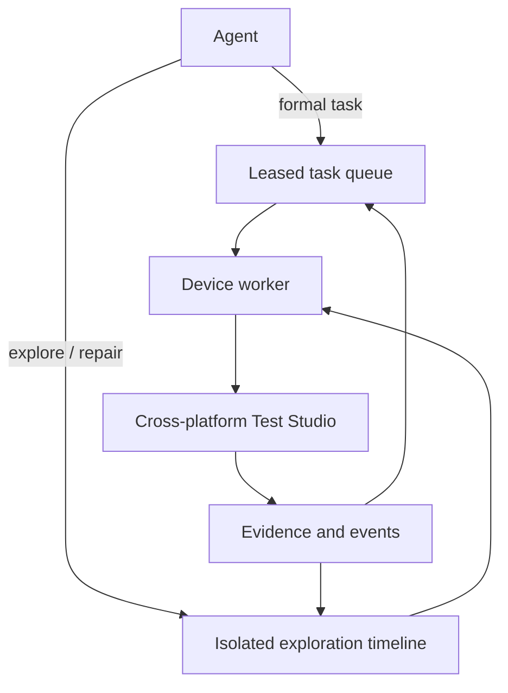

# Architecture



Formal tasks retain lease, retry and terminal-state semantics. Exploration is append-only and must be explicitly completed or discarded before any draft is promoted elsewhere.

```text
Web console / API client
          |
       FastAPI
       /     \
task service  case publication service
     |                |
lease scheduler   preview/commit/undo
     |                |
     +------ repository ports ------+
                    |
                 SQLite

Execution Agent -> claim -> local FlowRunner -> complete with report
```

SQLite uses WAL mode and transactional mutations. A future PostgreSQL/MySQL adapter must preserve atomic claim behavior. Tasks use expiring leases so an interrupted agent does not leave permanent running state.

Case publication is a separate transaction boundary. Preview records additions, duplicates and conflicts. Commit requires the operation identifier as confirmation, is idempotent, and stores enough previous state for undo.

Authentication is a bearer-token reference implementation. Production deployments should put the service behind HTTPS and may replace it with OIDC or trusted reverse-proxy authentication.
